## **Physically Based Shading at Disney** 

## **1 Introduction** 

Following our success with physically based hair shading on Tangled, we began considering physically based shading models for a broader range of materials. With the physically based hair model, we were able to achieve a great degree of visual richness while maintaining artistic control. However, it proved challenging to integrate the lighting of the hair with the rest of the scene which had still used traditional “ad-hoc” shading models and punctual lights. For subsequent films we wanted to increase the richness of all of our materials while making lighting responses more consistent between materials and environments and also wanted to improve artist productivity through the use of simplified controls. When we began our investigation it wasn’t obvious which models to use or even how physically based we wanted to be. Should we be perfectly energy conserving? Should we favor physical parameters like index of refraction? 

For diffuse, Lambert seemed to be the accepted norm, while specular seemed to get most of the attention in the literature. Some models such as Ashikhmin-Shirley (2000) aimed to be intuitive and practical while physically plausible, while others such as He et al. (1991) provided a more comprehensive physical model. Still others aimed at improved data fitting, but few of these are appropriate for direct manipulation. We could have implemented several models and let the artists choose and combine them, but then we’d have been back to the parameter explosion we were trying to get away from. 

One study of a large variety of measured materials was Ngan et al. (2005) which compared five popular models. Some models fared better than others overall, but interestingly, there was a strong correlation between the models’ performances — some materials were well represented by all the models, and for others, no model proved suitable. Adding an additional specular lobe helped in only a few of the cases. This begs the question: what is not being represented in the difficult materials? 

To answer this question and to evaluate BRDF models more intuitively we developed a new BRDF viewer that could display and compare both measured and analytic BRDFs. We discovered new, intuitive ways to view measured BRDF data and we found interesting features in the measured materials that weren’t well represented by known models. 

In these course notes we will share observations from studying measured materials along with insights we’ve gleaned about which models fit the measured data and where they fall short. We will then present our new model which is now being used on all current productions. We will also describe our experience of adopting this new model in production and discuss how we were able to add the right level of artistic control while preserving simplicity and robustness. 

## **2 The microfacet model** 

We will define our BRDF and compare with measured materials in terms of the microfacet model. The microfacet model postulates that if a surface reflection can occur between a given light vector _**l**_ and view vector _**v**_, then there must exist some portion of the surface, or microfacet, with a normal aligned halfway between the _**l**_ and _**v**_ vectors. This “half vector”, sometimes referred to as the microsurface normal, is thus defined as:

$$
\mathbf{h} = \frac{\mathbf{l} + \mathbf{v}}{|\mathbf{l} + \mathbf{v}|}.
$$

A general form of the microfacet model for isotropic materials is:

$$
f(\mathbf{l}, \mathbf{v}) = \mathrm{diffuse} + \frac{D(\theta_h)F(\theta_d)G(\theta_l, \theta_v)}{4\cos\theta_l\cos\theta_v}.
$$

The diffuse term is a function of unknown form. Lambert diffuse is often assumed and is represented by a constant value. For the specular term, $D$ is the microfacet distribution function and is responsible for the shape of the specular peak, $F$ is the Fresnel reflection coefficient, and $G$ is the geometric attenuation or shadowing factor.

$\theta_l$ and $\theta_v$ are the angles of incidence of the $\mathbf{l}$ and $\mathbf{v}$ vectors with respect to the normal, $\theta_h$ is the angle between the normal and the half vector, and $\theta_d$ is the “difference” angle between $\mathbf{l}$ and the half vector (or, symmetrically, $\mathbf{v}$ and $\mathbf{h}$).

Most physically plausible models not specifically described in microfacet form can still be interpreted as microfacet models in that they have a distribution function, a Fresnel factor, and some additional factor which could be considered a geometric shadowing factor. The only real difference between microfacet models and other models is whether they include the explicit $\frac{1}{4\cos\theta_l\cos\theta_v}$ factor that comes from the microfacet derivation. For models that don’t include this factor, an implied shadowing factor can be determined by multiplying the model by $4\cos\theta_l\cos\theta_v$ after factoring out the $D$ and $F$ factors. 

## **3 Visualizing measured BRDFs** 

## **3.1 The “MERL 100”** 

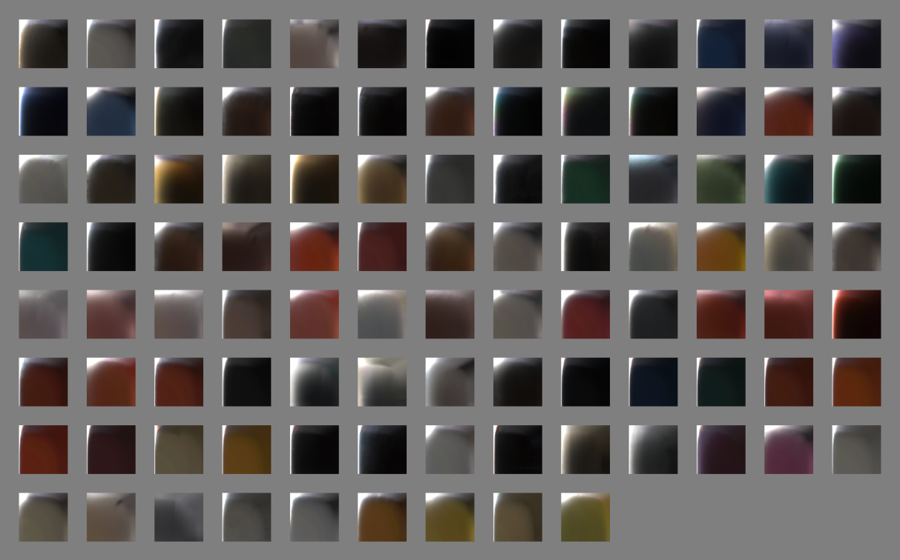

Figure 1: Images slices of MERL 100 BRDFs. 

A set of 100 isotropic BRDF material samples was captured by Matusik et al. in 2003 covering a wide range of materials including paints, woods, metals, fabric, stone, rubber, plastic, and other synthetic materials. This data set is freely available from Mitsubishi Electric Research Laboratories at www.merl.com/brdf and is commonly used for evaluating new BRDF models. Slices of these BRDFs are shown in Figure 1. 

Each BRDF in the MERL 100 is densely sampled into a 90 by 90 by 180 cube along the $\theta_h$, $\theta_d$, and $\phi_d$ axes respectively. These correspond to 1 degree increments except for the $\theta_h$ axis which was warped to concentrate data samples near the specular peak. The measurements have been filtered and extrapolated as needed so that there are no holes in the data. This is good in that the data is easy to use, but it’s not clear how accurate the data is, particularly near the horizon. Because of this, some researchers discard data near the horizon when performing fitting, but this data is still useful to consider as it can have a profound effect on the material appearance. 

## **3.2 BRDF Explorer** 

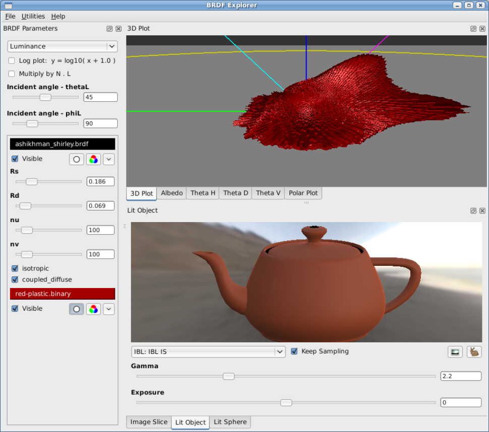

Figure 2: Disney BRDF Explorer 

To examine the MERL measured materials and compare with analytic models, we developed a new tool, the BRDF Explorer, shown in Figure 2. It is available as open source at github.com/wdas/brdf and has the following features: 

- Ability to load multiple analytic BRDFs written in GLSL 

- Ability to load measured BRDFs, including the anisotropic material samples captured by Ngan et al. 

- Multiple data plots (3D hemispherical view, polar plot, and various cartesian plots) 

- Computed albedo plot (i.e., directional-hemispherical reflectance) 

- Image slice view with exposure controls 

- Lit object view with importance-sampled IBL 

- Lit sphere view 

- Dynamic UI controls for parametric models 

This tool has been invaluable in comparing measured materials with existing analytic models as well as in developing our new model. Surprisingly, it has also proven very useful for artists as an interactive BRDF editor, giving them a deeper understanding of the model parameters and BRDF space. 

## **3.3 Image slice** 

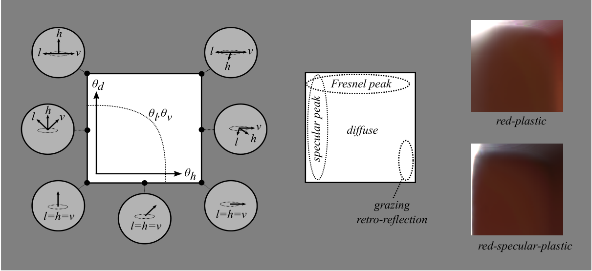

Figure 3: BRDF images slices for _red-plastic_ and _specular-red-plastic_ shown along with schematic view of “slice space.” 

One of the simplest, most intuitive ways to visualize a measured material is to simply view it as a stack of images, and we’ve found this to be a very powerful tool to gain an intuition about the data. As it turns out, all of the interesting features in the MERL 100 materials are visible in the $\phi_d = 90$ slice. A schematic view of this space along with two material samples is shown in Figure 3. Other slices are roughly just warped versions of that slice as shown in Figure 4. This observation has been exploited in recent work such as Romeiro (2008) and Pacanowski (2012) as the basis for simplified isotropic BRDF models of the form $f(\theta_h, \theta_d)$. 

In the image slice, the left edge represents the specular peak, and the top edge represents the Fresnel peak. Note that along the bottom edge, the light and view vectors are coincident, thus the bottom 

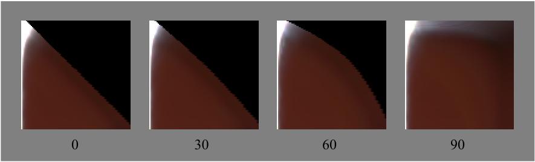

Figure 4: Slices of _specular-red-plastic_ for different values of $\phi_d$, the azimuthal rotation of $\mathbf{l}$ around the half vector. The black region in the upper right corner represents a portion of the BRDF domain where either the $\mathbf{l}$ or $\mathbf{v}$ vector is below the horizon. 

edge represents retroreflection. The lower-right corner in particular represents grazing retroreflection. Diffuse reflectance is exhibited over the entire BRDF space, but the middle of the image is generally isolated to the diffuse response. 

The schematic image in Figure 3 also includes an isoline of $\theta_l$ or $\theta_v$. Many diffuse effects tend to follow this contour. Note that these isolines straighten as $\phi_d$ approaches zero, and comparing $\phi_d$ slices can give insight about which parts of the material response are due to diffuse reflection and which are specular. Another hint is of course color; diffuse reflectance is due to subsurface scattering and absorption which results in a visible tint, whereas specular reflectance comes from the surface and is not tinted (unless the surface is metallic, in which case there is no diffuse component). 

## **4 Observations from MERL materials** 

## **4.1 observations** 

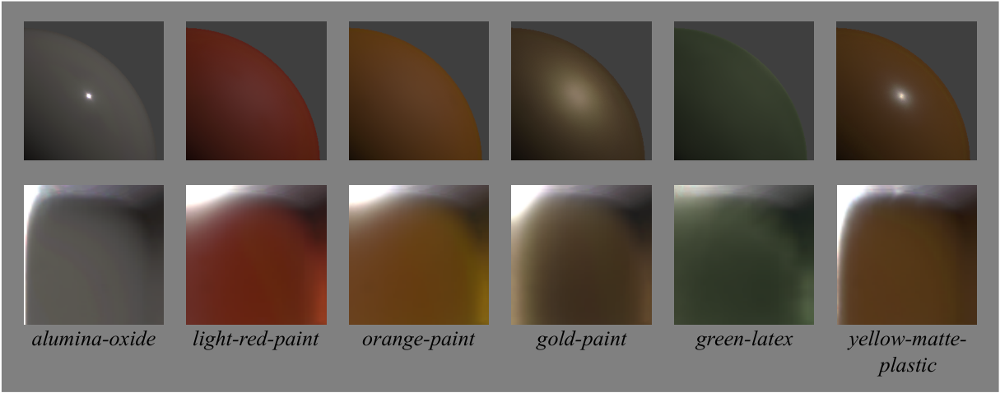

Figure 5: Materials exhibiting diffuse color variation. Top row: point-light responses on rendered spheres; bottom row: BRDF image slices. 

Diffuse reflectance represents light that is refracted into the surface, scattered, partially absorbed, and re-emitted. Given that some of the light is absorbed, the diffuse response will be tinted with the surface color, and any portion of a non-metallic material that is tinted can be considered to be diffuse. 

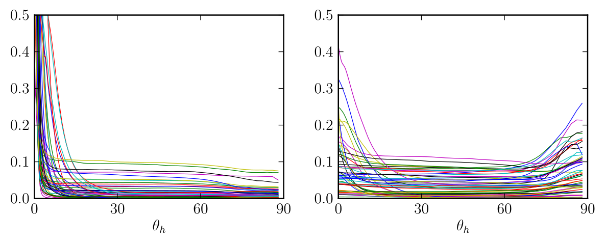

Figure 6: Retroreflective responses of MERL 100 materials. Left: 50 smooth materials ($f(0) > 0.5$); right: 50 rough materials ($f(0) < 0.5$). The peak near $\theta_h = 0$ is the specular peak, and the peak (or drop) near $\theta_h = 90$ represents grazing retroreflection. 

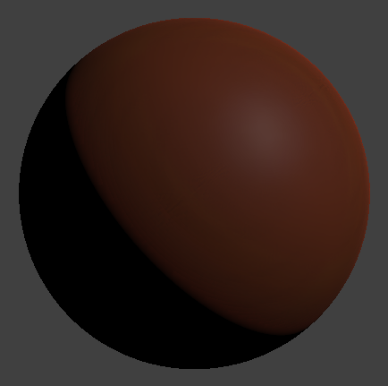

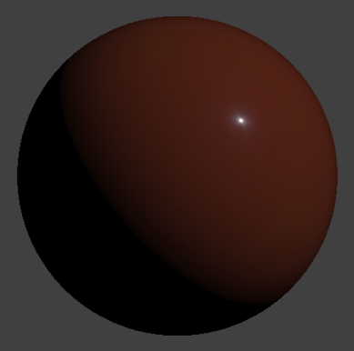

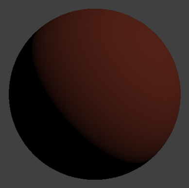

Figure 7: Point light response of _red-plastic_ , _specular-red-plastic_ , and Lambert diffuse. 

The Lambert diffuse model assumes that the refracted light has scattered enough that it has lost all directionality and thus the diffuse reflectance is constant. However, it can be seen in the various image slices in Figures 1 and 5 that very few materials exhibit a Lambertian response. [Note: a Lambert _shader_ includes an $\mathbf{n} \cdot \mathbf{l}$ factor, but that’s part of the lighting integral, not the BRDF.] 

As shown in Figure 6, many materials show a drop in grazing retroreflection, and many others show a peak. This appears to be a diffuse phenomenon due to the apparent tinting in the image slices. Notably, this is strongly correlated to roughness — smooth surfaces, i.e., those with a higher specular peak, tend to have a shadowed edge, and rough surfaces tend to have a peak instead of a shadow. This correlation can be seen in the retroreflective response curves and also in the rendered spheres in Figure 7. 

The grazing shadow for smooth surfaces is predicted by the Fresnel equations: at grazing angles, more energy is reflected from the surface and less is refracted into the surface to be diffusely re-emitted. However, diffuse models don’t generally consider the effect of surface roughness on Fresnel refraction and either assume a smooth surface or ignore the Fresnel effect. 

The Oren-Nayar model (1995) predicts a retroreflective increase for rough diffuse surfaces that 

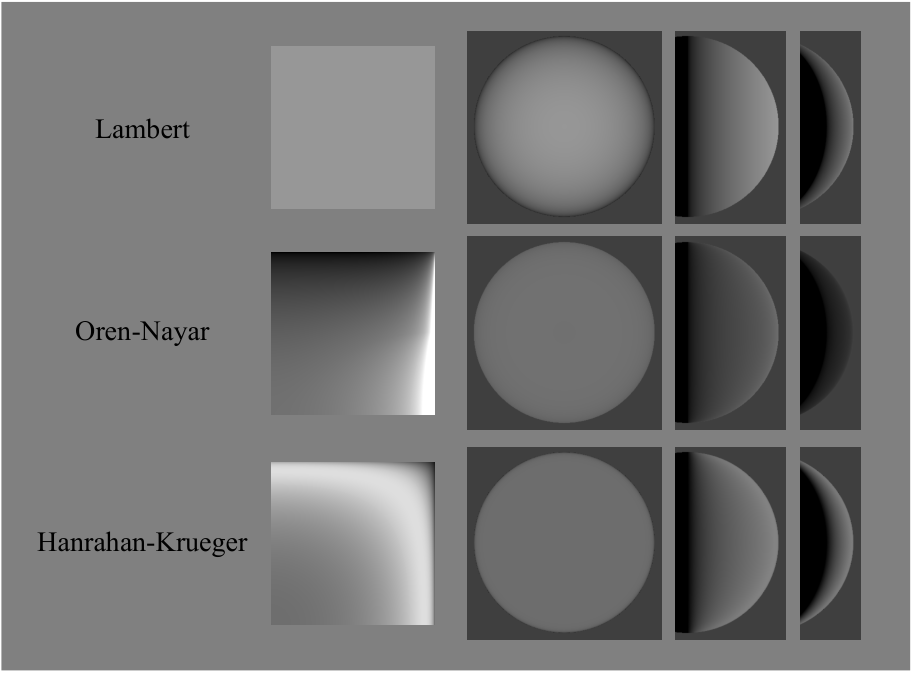

Figure 8: BRDF slices and point-light responses of Lambert, Oren-Nayar, and Hanrahan-Krueger models. 

flattens the diffuse shape. However, this retroreflective peak isn’t as strong as the measured data and the rough measured materials don’t generally exhibit flattening of the diffuse. The Hanrahan-Krueger model (1993), derived from subsurface scattering theory, also predicts a flattening of the diffuse shape, but doesn’t have a strong enough peak at the edge. In contrast to Oren-Nayar, this model assumes a perfectly smooth surface. The Oren-Nayar and Hanrahan-Krueger models are compared in Figure 8. 

Besides the retroreflective peak, additional diffuse variation can be seen in the image slices in Figure 5. Both intensity and color variation can be seen that follows the $\theta_l / \theta_v$ isolines. This may be due in some cases to layered subsurface scattering. However, even layered subsurface scattering models generally consider the surface to be smooth and don’t produce a strong retroreflective peak. 

## **4.2 Specular D observations** 

The microfacet distribution function, $D(\theta_h)$, can be observed from the retroreflective responses of the measured materials as shown in Figure 6. The materials were divided into two groups based on the height of the peak which can be seen as an indication of surface roughness. The highest peak, from _steel_, was more than 400. Once the peak flattens out, the remaining portion of the curve is likely due to diffuse reflectance. 

The vast majority of the MERL materials have specular lobes with tails that are much longer than traditional specular models. An example is the _chrome_ sample shown in Figure 9. The specular response of this material is typical for smooth, highly polished surfaces, with a specular peak only a couple of degrees wide and a specular tail that is many times wider. Curiously, the traditional Beckmann, Blinn Phong, and Gaussian distributions are nearly identical at this width and cannot represent either the peak or the tail well. 

The need for a wider tail was the motivation for the GGX distribution introduced by Walter et al. (2007); GGX has a much longer tail than other distributions but still fails to capture the glowy 

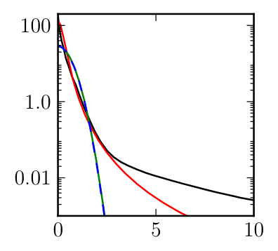

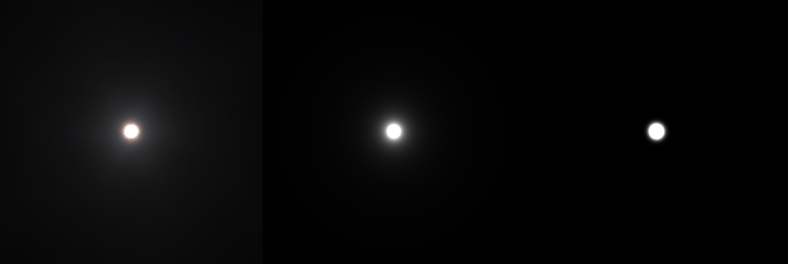

Figure 9: Several specular distributions fit to MERL chrome. Left: log-scale plots of specular peak vs $\theta_h$ (degrees); black = chrome, red = GGX ($\alpha = 0.006$), green = Beckmann ($m = 0.013$), blue = Blinn Phong ($n = 12000$). Right: (clipped) point light responses from chrome, GGX, and Beckmann. 

highlight of the chrome sample. The importance of modeling the tail response for fitting measured materials was also the basis of two recent models, L¨ow et al. (2012) and Bagher et al. (2012). Both of these models add an additional parameter to control the tail separately from the peak. Another option for modeling the tail is the use of a second wider specular peak added to the first as suggested by Ngan. 

## **4.3 Specular F observations** 

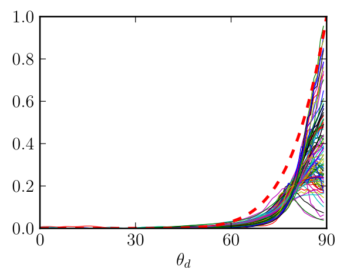

Figure 10: Normalized Fresnel responses of MERL 100 materials plotted at vs $\theta_d$. Responses were averaged over $\theta_h$ from 1 to 4 degrees, the incident response was subtracted off, and the curves were then normalized over $\theta_d$ from 45 to 80 degrees for comparison of shape. The dashed line represents the theoretical Fresnel response.

The Fresnel reflection factor, $F(\theta_d)$, represents the increase in specular reflection as the light and view vectors move apart and predicts that all smooth surfaces will approach 100% specular reflection at grazing incidence. For rough surfaces, 100% specular reflection will not be achieved, but reflectance will still become increasingly specular.

Fresnel response curves for the MERL materials are shown in Figure 10. The curves were offset and scaled to compare the overall shape of their response. Every material shows some increase in reflectance near $\theta_d = 90$. This can also be seen along the top edges of the image slices in Figure 1.

Notably, the steepness of many of the curves near grazing angles is greater than predicted by the Fresnel effect. This observation was in fact the motivation of the Torrance-Sparrow (1967) microfacet model to explain the “off-specular peak” witnessed at higher incidence angles. Note that the $\frac{1}{4\cos\theta_l\cos\theta_v}$ factor in the microfacet model goes to infinity at grazing angles. The reason that this is not a problem (both in the model and the real world) is that grazing reflectance is reduced by shadowing effects of the microsurface. The $G$ factor represents the shadowing of the light vector and, symmetrically, the masking of the view vector, and keeps the grazing reflectance in check. But even though the $G$ factor represents shadowing, the combination of $G$ with $\frac{1}{4\cos\theta_l\cos\theta_v}$ effectively amplifies the Fresnel effect.

## **4.4 Specular G (and albedo) observations** 

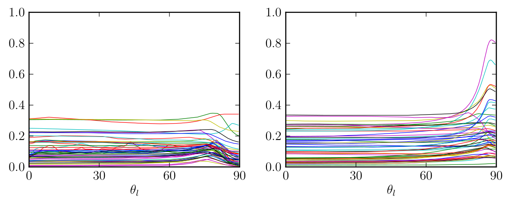

Figure 11: Albedo plots of MERL 100 materials. Left: 50 smooth materials; right: 50 rough materials. 

It is difficult to isolate _G_ in the measured data as it requires accurate estimation of the _D_ and _F_ factors as well as isolation of specular from diffuse. However, the effect of _G_ can be seen indirectly in its on the directional albedo. 

Albedo is the ratio of total reflected energy to total incident energy. In broad terms, it is representative of the color of a surface and must be less than 1 for all wavelengths. Albedo can also be considered for light coming from a single direction, such as from the sun, in which case the albedo becomes a directional function dependent on incident angle, and must be less than 1 for all angles and wavelengths. 

The directional albedo of most materials is relatively flat for the first 70 degrees as seen in Figure 11, and the albedo at grazing angles is strongly correlated with surface roughness. Smooth materials show a slight increase around 75 degrees followed by a drop towards 90. Rough surfaces increase, often significantly, all the way to the grazing incidence. Notably, the albedo values overall are fairly low, with few materials having an albedo above 0.3. 

The grazing retro-reflection exhibited by many rough materials also contributes significantly to this gain, as evidenced by a chromatic tint in the albedo. 

The albedo response corresponding to a selection of modeled $G$ factors is shown in Figure 12 for both a very smooth and a very rough surface. Notably, omitting $G$ and $\frac{1}{\cos\theta_l\cos\theta_v}$ entirely, referred to as the “No G” model, results in an overly dark response at grazing angles. The important point here 

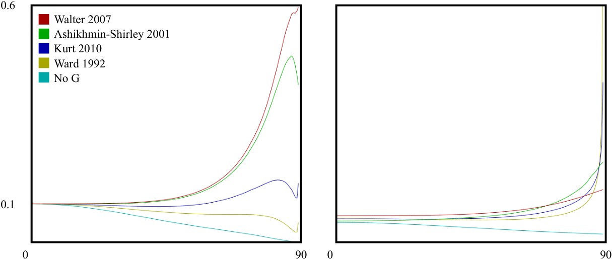

Figure 12: Albedo plots comparing several specular $G$ models. All plots use the same $D$ (GGX/TR) and $F$ factors. Left: smooth surface ($\alpha = 0.02$); right: rough surface ($\alpha = 0.5$). The “no $G$” model excludes the $G$ and $\frac{1}{\cos\theta_l\cos\theta_v}$ factors. 

is that the choice of the $G$ function has a profound effect on the albedo which in turn has a profound effect on surface appearance.

Several specular models have been developed specifically with the goal of producing a more plausible albedo response curve. For some of these, the intent is to make the albedo perfectly flat to maintain energy balance. Based on the albedo plots of the Merl data in Figure 11, this is not an unreasonable target though most of the materials do show some sort of grazing gain. Even then, some of the grazing gain is likely due to non-specular effects.

With a few simplifying assumptions, it’s possible to derive the shadowing function from the microfacet distribution, $D$, following the method of Smith. This was the approach used by Walter (2007) and Schlick (1994). As can be seen in Figure 12, the grazing reflectance of the Smith model from Walter increases significantly for smooth surfaces, an effect that is not seen in the measured data. For rougher values, the response seems more plausible. Note that the Smith $G$ has an analytic form for only a small number of functions and a tabular integration or some other approximation is often used.

A recent empirical model from Kurt et al. (2010) takes a different approach and proposes a data-fitting model with a free parameter. Figure 12 shows the Kurt model using $\alpha = 0.25$; other values of $\alpha$ can produce a wide range of albedo responses. Of concern though is that the Kurt albedo diverges near grazing angles, significantly for rough distributions. Another option is to just use one of the Smith $G$ derivations from Walter, or even the simpler one from Schlick, and decoupling the $G$ roughness as a free parameter.

## **4.5 Fabric** 

Many of the fabric samples in the MERL database exhibit a specular tint at grazing angles and also have a Fresnel peak that is stronger than with materials of comparable roughness. Examples of these are shown in Figure 13. 

The tinted grazing response could be explained by the fact that cloth often has transmissive fibers which pick up the material color near object silhouettes. This could also explain additional gain for 

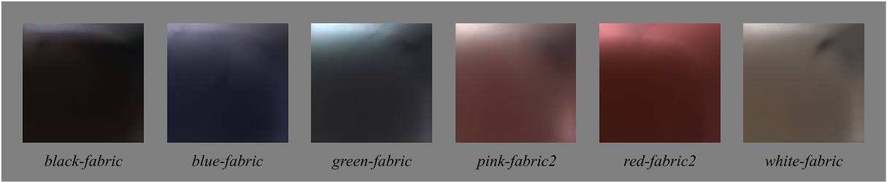

Figure 13: BRDF image slices of various fabric samples. 

cloth at grazing angles beyond what is predicted by the microfacet model. 

While many fabrics can have very complex material response, the MERL fabrics seem relatively easy to model. 

## **4.6 Iridescence** 

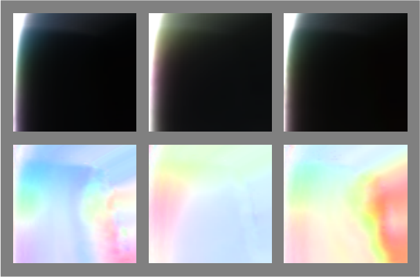

Figure 14: BRDF image slices of _color-changing-paint-1_ , _2_ , and _3_ . Top row: original data; bottom row: corresponding chroma images generated by scaling by 1 _/_ max(r _,_ g _,_ b) per pixel. 

Three color changing paints, shown in Figure 14, exhibit coherent patches of color across the $(\theta_h, \theta_d)$ space with minimal dependence on $\phi_d$. This appears to be a completely specular phenomenon given that there’s very little reflectance away from the specular peak. This could be modeled simply by modulating the specular hue as a function of $\theta_h$ and $\theta_d$ perhaps with a small texture map. 

## **4.7 Data anomalies** 

Some anomalies in the MERL data are shown in Figure 15. 

- Some of the very shiny materials, particularly the metals, exhibit asymmetric highlights suggestive of lens flare or perhaps anisotropic surface scratches. 

- Data past about 75 degrees appears to be extrapolated. 

- The grazing response of the fabrics often has strange discontinuities, possibly due to the fabrics being stretched over spheres during capture and wrinkled near the edges. 

- Some of the woods exhibit specular modulation patterns along $\theta_d$ that might be due to wood grain. 

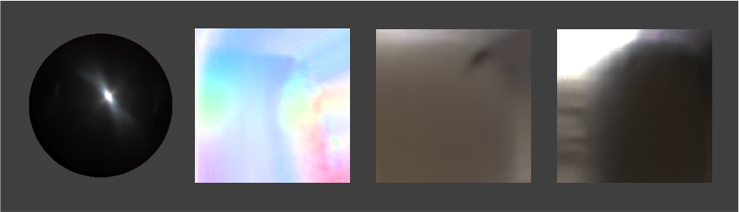

Figure 15: Anomalies in the MERL data. From left to right: the point-light response of _steel_ exhibits an asymmetric highlight, a chroma plot of _color-changing-paint1_ shows extrapolated grazing data (visible in all materials), _white-fabric_ exhibits shadowing near grazing suggestive of a wrinkle, and _fruitwood-241_ (shown as stored, in warped- $\theta_h$ space) exhibits specular variation suggestive of wood grain. 

- Subsurface scattering effects are baked in. 

These are not criticisms of the data or the capture process but rather just a caution to not overfit or overinterpret the data. It’s also potentially part of the answer to the question posed earlier about why some materials are hard to fit. 

## **5 Disney “principled” BRDF** 

## **5.1 Principles** 

In developing our new physically based reflectance model, we were cautioned by artists that we need our shading model to be art directable and not necessarily physically correct. Because of this, our philosophy has been to develop a “principled” model rather than a strictly physical one. These were the principles that we decided to follow when implementing our model: 

1. Intuitive rather than physical parameters should be used. 

2. There should be as few parameters as possible. 

3. Parameters should be zero to one over their plausible range. 

4. Parameters should be allowed to be pushed beyond their plausible range where it makes sense. 

5. All combinations of parameters should be as robust and plausible as possible. 

We thoroughly debated the addition of each parameter. In the end we ended up with one color parameter and ten scalar parameters described in the following section. 

## **5.2 Parameters** 

- _baseColor_ : the surface color, usually supplied by texture maps. 

- _subsurface_ : controls diffuse shape using a subsurface approximation. 

- _metallic_ : the metallic-ness (0 = dielectric, 1 = metallic). This is a linear blend between two different models. The metallic model has no diffuse component and also has a tinted incident specular, equal to the base color. 

- _specular_ : incident specular amount. This is in lieu of an explicit index-of-refraction. 

- _specularTint_ : a concession for artistic control that tints incident specular towards the base color. Grazing specular is still achromatic. 

- _roughness_ : surface roughness, controls both diffuse and specular response. 

- _anisotropic_ : degree of anisotropy. This controls the aspect ratio of the specular highlight. (0 = isotropic, 1 = maximally anisotropic.) 

- _sheen_ : an additional grazing component, primarily intended for cloth. 

- _sheenTint_ : amount to tint sheen towards base color. 

- _clearcoat_ : a second, special-purpose specular lobe. 

- _clearcoatGloss_ : controls clearcoat glossiness (0 = a “satin” appearance, 1 = a “gloss” appearance). 

Rendered examples of the effect of each of our parameters are shown in Figure 16. 

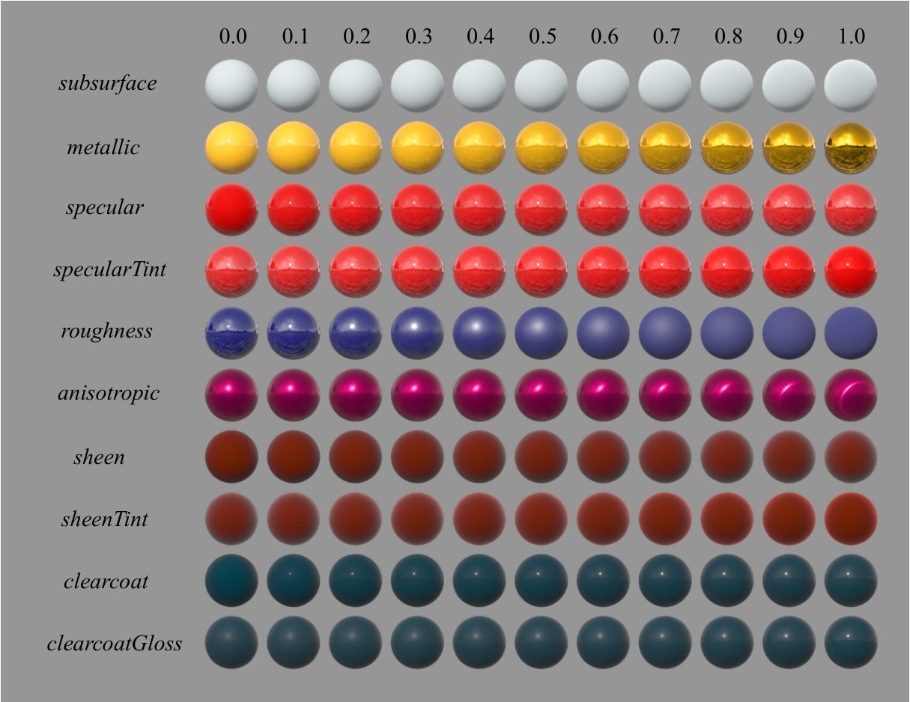

Figure 16: Examples of the effect of our BRDF parameters. Each parameter is varied across the row from zero to one with the other parameters held constant. 

## **5.3 model details** 

Some models include a diffuse Fresnel factor such as: 

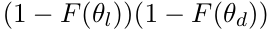

where $F(\theta)$ is the Fresnel factor for reflection. 

[Note: from the Fresnel law for refraction, and to preserve Helmholtz reciprocity, it’s necessary to account for refraction twice, once on the way in and once on the way out of the surface.] 

As seen in the measured data observations, and based on our past studio experience, the Lambert diffuse model is often too dark on the edges, and adding a Fresnel factor to make it more physically plausible only makes it darker. 

Based on our observations, we developed a novel empirical model for diffuse retroreflection that transitions between a diffuse Fresnel shadow for smooth surfaces and an added highlight for rough surfaces. A possible explanation for this effect may be that, for rough surfaces, light enters and exits the sides of micro-surface features, causing an increase in refraction at grazing angles. In any event, our artists like it, and it is similar to features we used to have in our ad-hoc model except that it is now more plausible and has a physical basis. 

In our model, we ignore the index of refraction for the diffuse Fresnel factor and assume no incident diffuse loss. This allows us to directly specify the incident diffuse color. We use the Schlick Fresnel approximation and modify the grazing retroreflection response to go to a specific value determined from roughness rather than zero. 

Our base diffuse model is: 

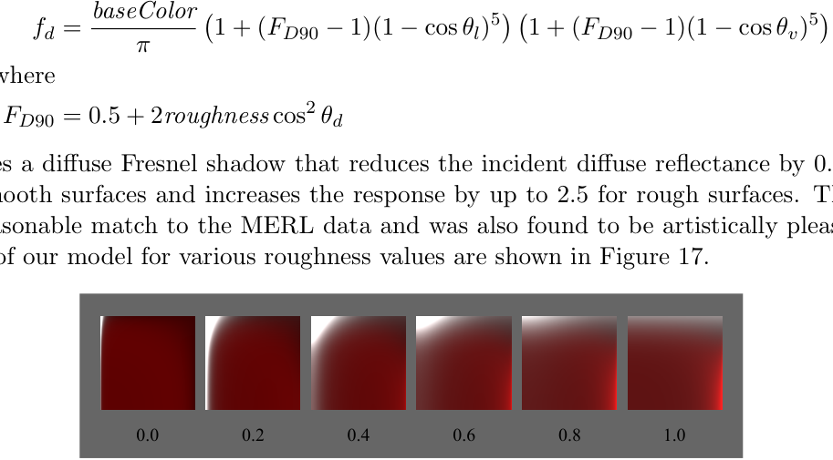

where 

This produces a diffuse Fresnel shadow that reduces the incident diffuse reflectance by 0.5 at grazing angles for smooth surfaces and increases the response by up to 2.5 for rough surfaces. This seems to provide a reasonable match to the MERL data and was also found to be artistically pleasing. BRDF image slices of our model for various roughness values are shown in Figure 17. 

Figure 17: BRDF images slices of our model for various roughness values. 

Our subsurface parameter blends between the base diffuse shape and one inspired by the HanrahanKrueger subsurface BRDF. This is useful for giving a subsurface appearance on distant objects and on objects where the average scattering path length is small; it’s not, however, a substitute for doing full subsurface transport as it won’t bleed light into the shadows or through the surface. 

## **5.4 Specular D details** 

Of the popular models, GGX has the longest tail. This model is in fact equivalent to the TrowbridgeReitz (1975) distribution favored by Blinn (1977) for its ability to match experimental data. However, this distribution still does not have a long enough tail for many materials. 

Trowbridge and Reitz compared their distribution function along with several other distributions to measurements of ground glass. One of the other distributions, from Berry (1923), has a very similar form but with an exponent of 1 instead of 2 resulting in an even longer tail. This suggests a more general distribution with a variable exponent, introduced here and dubbed Generalized-Trowbridge-Reitz, or GTR: 

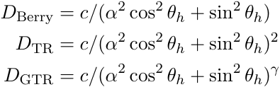

In each of these distributions, $c$ is a scaling constant, and $\alpha$ is a roughness parameter with values between 0 and 1;$\alpha = 0$produces a perfectly smooth distribution (i.e. a delta function at $\theta_h=0$) and $\alpha=1$ produces a perfectly rough or uniform distribution. 

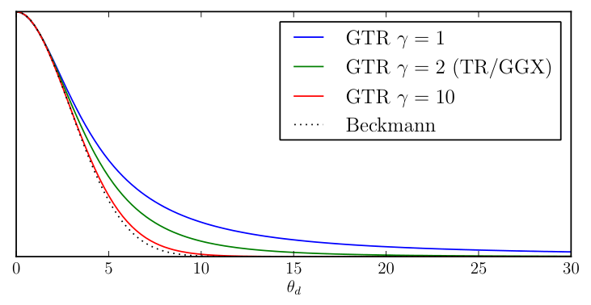

Figure 18: GTR distribution curves vs $\theta_h$ for various $\gamma$ values: 

Preliminary fitting results suggest typical values of $\gamma$ between 1 and 2. Interestingly, GTR with $\gamma = 3/2$ is equivalent to the Henyey-Greenstein phase function for $\theta = 2\theta_h$; doubling of $\theta_h$ can be viewed as extending the distribution from the hemisphere to the sphere.

A plausible microfacet distribution must be normalized, and for efficient rendering it must also support importance sampling. Both require the distribution to be integrable over the hemisphere. Fortunately, this function has a simple closed-form integral. Normalization and importance sampling functions as well as an efficient anisotropic form are derived in Appendix B.

For our BRDF, we chose to have two fixed specular lobes, both using the GTR model. The primary lobe uses $\gamma = 2$, and the secondary lobe uses $\gamma = 1$. The primary lobe represents the base material and may be anisotropic and/or metallic. The secondary lobe represents a clearcoat layer over the base material, and is thus always isotropic and non-metallic.

For roughness, we found that mapping $\alpha = \mathit{roughness}^2$ results in a more perceptually linear change in the roughness. Without this remapping, very small and non-intuitive values were required for matching shiny materials. Also, interpolating between a rough and smooth material would always produce a rough result. The resulting interpolation is shown in Figures 16 and 19.

In place of an explicit index of refraction, or IOR, our _specular_ parameter determines the incident specular amount. The normalized range of this parameter is remapped linearly to the incident specular range $[0.0, 0.08]$. This corresponds to IOR values in the range $[1.0, 1.8]$, encompassing most common materials. Notably, the middle of the parameter range corresponds to an IOR of 1.5, a very typical value, and is also our default. The _specular_ parameter may be pushed beyond one to reach higher IOR values but should be done with caution. This mapping of the parameter has helped greatly in getting artists to make plausible materials given that real-world incident reflectance values are so unintuitively low.

For our clearcoat layer, we use a fixed IOR of 1.5, representative of polyurethane, and instead allow artists to scale the overall strength of the layer using the _clearcoat_ parameter. The normalized parameter range corresponds to an overall scale of $[0, 0.25]$. This layer, even though it has a large visual impact, represents a relatively small amount of energy so we don’t subtract any energy from the base layer. When set to zero, the clearcoat layer is effectively disabled and incurs no cost.

## **5.5 Specular F details** 

For our purposes, the Schlick Fresnel approximation is sufficient and substantially simpler than the full Fresnel equations; the error introduced by the approximation is significantly less than the error due to the other factors. 

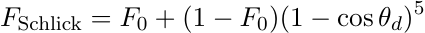

The constant, $F_0$, represents the specular reflectance at normal incidence and is achromatic for dielectrics and chromatic (i.e., tinted) for metals. The actual value depends on the index of refraction. Note that specular reflection comes from microfacets and thus $F$ depends on $\theta_d$, the angle between the light vector and the micronormal (i.e., the half vector), not the angle of incidence with the surface normal. 

The Fresnel function can be seen as interpolating (non-linearly) between the incident specular reflectance and unity at grazing angles. Note that the response becomes achromatic at grazing incidence as all light is reflected. 

## **5.6 Specular G details** 

For our model, we took a hybrid approach. Given that the Smith shadowing factor is available for the primary specular, we use the $G$ derived for GGX by Walter but remap the roughness to reduce the extreme gain for shiny surfaces. Specifically, we linearly scale the original roughness from the $[0, 1]$ range to a reduced range, $[0.5, 1]$, for the purposes of computing $G$. Note: we do this before squaring the roughness as described earlier, so the final $\alpha_g$ value is $(0.5 + \mathit{roughness} / 2)^2$.

This remapping was based on comparisons with measured data as well as artist feedback that the specular was just “too hot” for small roughness values. This gives us a $G$ function that varies with roughness, is at least partially physically based, and seems plausible. For our clearcoat specular we don’t have a Smith $G$ derivation and simply use the GGX $G$ with a fixed roughness of 0.25, found to be plausible and artistically pleasing.

## **5.7 Layering vs parameter blending** 

Once we settled on our new model we needed to decide how to integrate it into our shaders. The first question was which parameters needed to be spatially varying, and the answer was all of them; if an artist simply wants to put two different materials on a surface and mask between them, then they will need to interpolate between all of the parameters. Also, the mask will be filtered and at the blurred edge of the mask the material response must remain plausible. 

One benefit of our design principles in making all the parameters normalized and at least perceptually linear is that materials generally interpolate in a very intuitive way. An example of this is shown in Figure 19. 

Once we realized we could interpolate robustly, we wondered whether we could achieve all spatial variation through masks. The idea is that the artist would choose a list of material presets and 

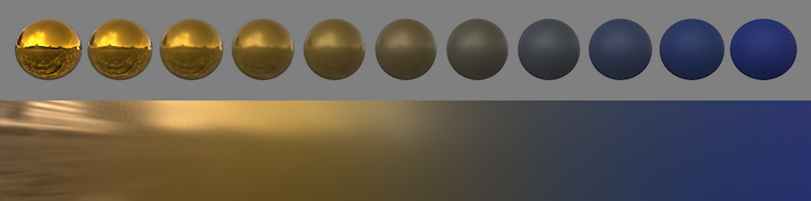

Figure 19: Interpolating between two very different materials, shiny metallic gold and blue rubber, using our model. 

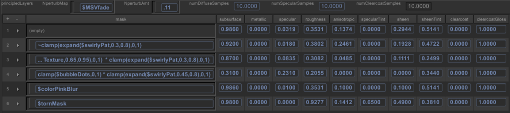

Figure 20: A screenshot of our shader editor showing material layers. The variables in the mask expressions refer to spatially varying shader modules, typically texture maps. 

then simply blend between them using texture masks. This turned out to be phenomenally successful, greatly simplifying workflow, improving material consistency, and making our shader evaluation extremely efficient. Our shader UI is shown in Figure 20. 

## **6 Production experience on Wreck-It Ralph** 

We deployed our “Principled Layers” shader on Wreck-It Ralph and used it on virtually every material except for hair (which still uses the model developed for Tangled). A variety of materials can be seen in Figure 21. Note that a separate normal was often used for the specular components to produce the sparkle effect seen here on the ground, carpet, and other granulated materials. 

In conjunction with our new material model, we also introduced new sampled area and image-based lights which are critical for making plausible materials look good; if you make a plausible shiny material and light it with a point light your highlight will be a tiny dot, but allowing lighters to adjust material properties, such as increasing roughness to fake an area light response, destroys the entire physically based shading paradigm. The good news is that the lighters really like area lights and IBLs for their controllability and also appreciate having a consistent material response. It’s also worth noting that the new material model was both a motivator and an enabler in the switch to sampled lights in that with our previous ad-hoc shading model it would have been too expensive for each reflectance module to perform its own sampled light integration. 

Based on the success on Wreck-It Ralph, our next shows are already using or planning to use our new shading model without modification. 

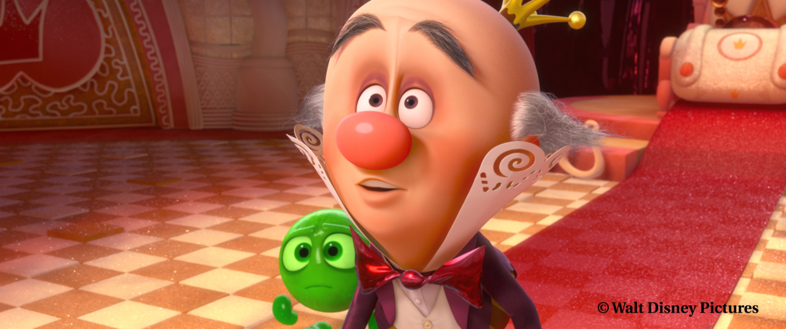

Figure 21: Production still from Wreck-It Ralph. 

## **6.1 Look development** 

One benefit of having a single BRDF on everything is that it simplified the development of our interactive material editor. Our “Material Designer” renders out a geometry buffer (or “g-buffer”) containing normals, object IDs, and material layer masks. Using these channels, it quickly performs image-based relighting while allowing all BRDF parameters to be interactively edited. Artists can rotate IBLs in real-time and see the full effect of all parameters and layers in full context on production models. 

Another benefit of the unified model is that it facilities a very simple material library consisting of a set of presets saved out from the Material Designer. A material can be picked from the library and added to a shader as an additional layer and then blended in with a mask. Layers can thus be quickly built up like a Photoshop layer stack. 

To judge a material fully, it’s critical to light it from all angles. As part of the switch to our new material model, we started proofing all elements using a variety of IBLs and all turntables include both element and lighting rotations. 

The end result of our new shader system is greatly improved productivity in look development, much shorter training time for new artists, and more consistently high-quality results. Notably, most of our look development artists were able to roll off of the show early due to the lack of the need for material “re-do”s in lighting. This was unprecedented. 

## **6.2 Lighting** 

As mentioned earlier, a different approach to lighting was needed to work with the new material model. This required a large learning curve. It was also a challenge adding back in artistic controls to lighting without overly compromising the physically based model. 

One of the biggest changes in lighting was the move to using IBLs as local fill lights. Most IBLs are used with light linking to specific elements in the shot and many have distance cutoffs. These were a big improvement over previous environment maps which largely ignored the material characteristics. Area lights were also a well-received addition. 

One of the biggest challenges for lighters initially was working with realistic light intensity values and falloff. We eventually developed a non-physical falloff control that works by making the light source virtually more distant while automatically adjusting the intensity to achieve the desired exposure at a 

given distance, however controlling light intensity and falloff remains a challenge for lighters. 

Another challenge for lighting is the fact that specular highlights now require some sort of tone mapping. Highlights on shiny materials can reach into the hundreds and simply clipping the values appears harsh, introduces banding as each color channel clips at a different location, and forces the core to always go to white. We developed a new global tone mapping operator that preserves color values for most of the display range and rolls off the top end while preserving color and contrast. We have a default setting that works reasonably in most cases but adjust the final values per shot during color grading. 

In the end though, the materials behave predictably which is a huge benefit to lighters and gives them a starting point that is physically plausible. 

## **6.3 Future work** 

One of the biggest issues currently is the lack of an intuitively controllable subsurface model. A key aspect of this is BRDF integration. Ideally there would be a match between the BRDF and the subsurface model such that the BRDF model could be used for distant objects, achieving equivalent results. Also, an artist should be able to increase the mean-free path from zero to add a subsurface effect to an object without changing the overall exposure — just the shape of the diffuse should change (and light should bleed into the shadows if diffusion is enabled). 

We would like to go further with modeling cloth reflectance. We know we can add a special shader to render cloth using captured reflectance data for particularly complicated cloth models, but we would like to investigate direct modeling of a wider range of cloth materials. We don’t currently have a show that is driving this need though. 

We’ve also received requests to add iridescence to our model. This should be as simple as adding specular color variation as previously discussed. 

## **A Selected history of BRDF models used in graphics** 

- Beckmann 1963 provided a model for scattering from rough surfaces based on a Gaussian distribution of surface slopes. 

- Torrance and Sparrow 1967 introduced the microfacet model. A Gaussian distribution of microfacet angles was assumed and a microfacet shadowing factor was derived from simplifying geometric assumptions. 

- Smith 1967 derived a shadowing function from the microfacet distribution. Notably, this shadowing function varied with surface roughness. 

- Phong 1975 proposed a computationally simple model of a specular highlight using an exponentiated cosine. 

- Trowbridge and Reitz 1975 derived a new microfacet distribution based on average surface irregularity of curved microsurfaces derived from an ellipsoid of revolution. They fit their model to measured data for rough glass and compared their results with Gaussian, Beckmann, Sirohi, and Berry distributions. 

- Blinn 1977 implemented the Torrance-Sparrow model with the Trowbridge-Reitz distribution (chosen for its computational efficiency as well as its physical basis). Blinn also proposed a microfacet distribution based based on the Phong model, commonly referred to as “Blinn Phong,” by adapting it to the more physically correct half-vector formulation. 

- Cook and Torrance 1981 implemented the Torrance-Sparrow model with the Beckmann distribution and studied spectral shifts due to the Fresnel factor. 

- He, Torrance, Sillion, and Greenberg 1991 presented a model that included specular, directional diffuse, and uniform diffuse components. The model is derived for polarized light and simplified for unpolarized light. 

- Ward 1992 presented an anisotropic specular model derived from the Beckmann distribution. Walter 2005 provided a more efficient exact implementation. 

- Lewis 1993 proposed a “modified Phong” model that included a normalization term for energy conservation. 

- Hanrahan and Krueger 1993 developed a diffuse BRDF model that approximates subsurface transport. 

- Oren and Nayar 1994 derived a diffuse model for rough surfaces based on Lambertian microfacets. 

- Schlick 1994 developed rational approximations to the various components of the microfacet model. The Schlick Fresnel approximation is widely used. Also, Schlick recognized the discontinuity in the Torrance-Sparrow shadowing term and suggested an approximation of the Smith shadowing function as an alternative. Schlick also presented an approximation to the Beckmann distribution. 

- Lafortune 1997 proposed using a sum of arbitrarily oriented Phong lobes as the basis for a general model. 

- Wolff, Nayar and Oren 1998 developed an improved diffuse model for very smooth surfaces which are darker at grazing angles than Lambert diffuse due to the Fresnel effect. This model is also combined in an approximate form with the Oren Nayar model to represent a continuum of smooth to rough diffuse surfaces. 

- Neumann et al. 1999 proposed a “stretched Phong” model intended for metallic surfaces that has an albedo that becomes flat as the surface becomes shiny. 

- Neumann et al. 1999b proposed a process to “pump up” the albedo of arbitrary BRDFs to improve energy balance. Previous models were shown to have an albedo that falls off too quickly with incident angle (except for the Ward model which is shown to diverge at grazing incidence). Each iterative pump up divides the BRDF by a measured correction factor making the albedo progressively flatter. 

- Ashikhmin, Premoˇze, and Shirley 2000 derived a shadowing function from numeric integration of arbitrary microfacet distributions. 

- Ashikhmin and Shirley 2000 presented a anisotropic Phong model that included a Fresnelweighted diffuse and energy conservation guarantees. 

- Kelemen and Szirmay-Kalos 2001 proposed an alternative shadowing term that approximates the Torrance-Sparrow shadowing function with a differentiable form. A coupled-diffuse model is also proposed such that the total albedo is always 1. 

- D¨ur 2006 improved the energy balance of the Ward model. 

- Edwards et al. 2006 proposed the “halfway vector disk” as a new domain for modeling specular distributions with the goal of perfect energy conservation (albedo = 1). An alternate non-conservative form is also presented for data fitting. 

- Ashikhmin and Premoˇze 2007 presented the “distribution BRDF” which smooths out the discontinuity in the shadowing term of Ashikhmin Shirley. A simple method for estimating specular distributions from backscattering images (such as from a single flash-lit photograph) is also provided. 

- Walter et al. 2007 derived Smith shadowing functions for the Phong and GGX distributions and provided an approximation of Smith shadowing for the Beckmann distribution. Note: GGX is equivalent to the Trowbridge-Reitz distribution. 

- Romeiro et al. 2008 showed than the MERL materials are well-represented by a simple bivariate form, _ρ_ ( _θh, θd_ ) and exploited this fact to proposed a simplified BRDF capture method. 

- Geisler-Moroder and D¨ur 2010 further refined this model to restore Helmholtz reciprocity and guarantee energy conservation. 

- Kurt et al 2010 extended the Beckmann distribution to anisotropic form and proposed a new parameterized shadowing function giving control over albedo and improving fitting for some materials. Two specular lobes are suggested for fitting many of the MERL materials. 

- Nishino and Lombardi 2011 proposed the “hemispherical exponential power distribution” or “Hemi-EPD” which has an additional degree of freedom to improve fitting power. The HemiEPD is used as a basis for the entire BRDF and parameters are fit to individual _θd_ slices and interpolated. Additionally, multiple lobes per _θd_ slice are required for many materials. 

- L¨ow et al. 2012 proposed a new “ABC” microfacet distribution inspired by Rayleigh-Rice smooth-surface scattering theory. Additionally, the “projected deviation vector” is presented as an alternative to the half-vector parameterization for data fitting. 

- Pacanowski et al. 2012 developed a framework for fitting rational functions to general isotropic BRDFs over the ( _θh, θd_ ) domain. An anisotropic form is also proposed as a simple scaling of the isotropic form with respect to _φh_ . 

- Bagher et al. 2012 proposed a new “shifted gamma” or “SGD” microfacet distribution derived to fit the range of observed slopes in the MERL database. An approximation of the Smith shadowing function for the SGD is provided. Additionally, the Fresnel term is modified with a correction term providing an additional degree of freedom, improving fitting ability. 

## **B GTR Microfacet Distribution** 

## **B.1 Microfacet distribution review** 

A plausible microfacet distribution must be normalized over the hemisphere such that the projected area of the microfacets is 1: 

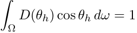

or in spherical coordinates: 

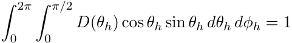

For importance sampling, it is convenient to choose _pdfh_ = _D_ ( _θh_ ) cos _θh_ given that it is already normalized. Note, _pdfh_ is the density with respect to the half vector; the density with respect to the light vector _**l**_ is: 

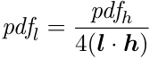

To generate samples over the hemisphere, the pdf is split into spherical components, _pdfh_ = _pdfθhpdfφh_ . For isotropic distributions this factorization is trivial as the distribution has no dependence on _φh_ and _pdfφh_ = 21 _π_[.][For][anisotropic][distributions,][the][factorization][is][accomplished][by][integrating] out _θh_ to get: 

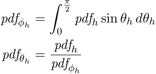

Each component pdf is then integrated to form a cdf and then inverted to form a corresponding sampling function: 

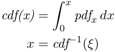

Given the two sampling functions and uniform random variables _ξ_ 1 and _ξ_ 2, _θh_ and _φh_ can be computed and projected to the coordinate frame around the normal _**n**_ , tangent _**x**_ , and bitangent _**y**_ to form the half vector _**h**_ . Finally, given a _**v**_ vector, _**l**_ can be computed by reflecting _**h**_ across _**v**_ : 

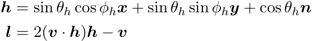

## **B.2 GTR** 

Following the above derivations, the normalized GTR distribution and sampling equations are: 

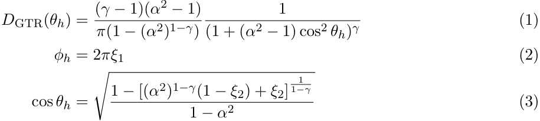

This distribution is valid for any _γ >_ 0, however, at _γ_ = 1 there is a singularity. Taking the limit as _γ →_ 1 produces this alternate form: 

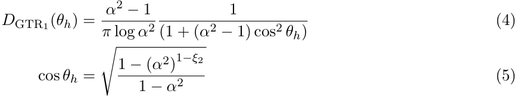

The values of _γ_ = 3 _/_ 2 and _γ_ = 2 have simplified forms, the latter being equivalent to GGX: 

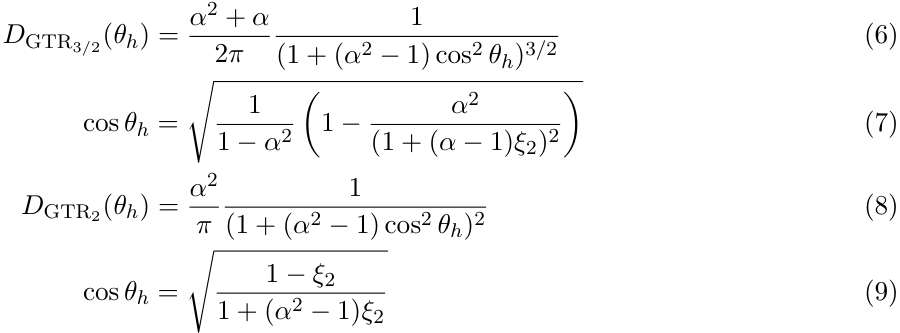

To form an anisotropic distribution, the roughness is varied with _φ_ by replacing _α_[with][cos] _α_ _x[φ]_[+][ sin] _α_ _y[φ]_[.] For _γ_ = 2 this results in: 

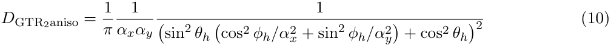

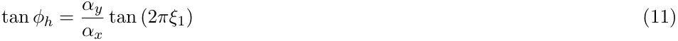

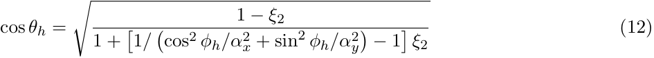

Substituting these vector identities 

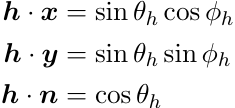

into equation (10) produces an efficient alternate form: 

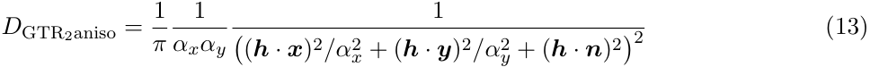

Further, factoring tan _φh_ from equation (11) into sin _φh_ and cos _φh_ , avoids special handling for the quadrants of _φh_ and also allows _**h**_ to be calculated more directly: 

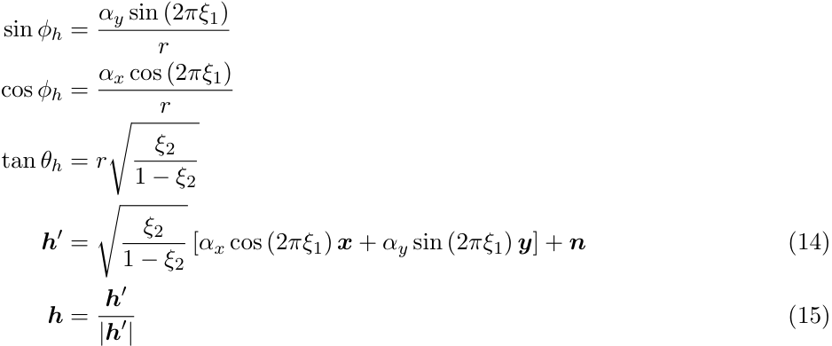

Note: _**h**[′]_ is the _projected_ half vector, tan _θh_ cos _φh_ _**x**_ + tan _θh_ sin _φh_ _**y**_ + _**n**_ , and _r_ is a normalization factor (equal to �1 _/_ �cos _φh/αx_ + sin _φh/αy_ �) which can be ignored due to cancellation. For arbitrary values of _γ_ , the normalization of the anisotropic distribution unfortunately does not have a closed form. 

## **Addenda** 

## **Anisotropic specular details** 

The original notes omitted the parameterization which is as follows: 

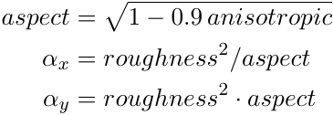

The 0.9 factor limits the aspect ratio to 10:1. 

## **Sheen details** 

The original notes omitted a description of sheen. Based on observations of the fabric samples described in section 4.5, the predominant effect missing from the base diffuse + specular model is the extra grazing reflectance seen along the top of the BRDF image slices. This component is very similar to the Fresnel factor. As this shape is very Fresnel-like, we model this as an additional BRDF lobe that uses the Schlick Fresnel shape, _sheen ·_ (1 _−_ cos _θd_ ) , and is optionally tinted towards the base color according to the _sheenTint_ parameter. 

## **Specular G revisited** 

Heitz recently published a thorough analysis of the microfacet shadowing function, _Understanding the Masking-Shadowing Function in Microfacet-Based BRDFs_ , JCGT 2014. Heitz proposed the “weak white furnace test” for verifying the plausibility of physically based masking functions and showed 

that, of known shadowing functions, only the Smith shadowing model and the V-cavity model are plausible, though the latter may be less realistic. 

Based on Heitz’ analysis, we have eliminated our ad-hoc remapping of Smith G for our primary specular. For metals, the result is obviously better, and for general materials it is arguably so, especially when rendering in a full GI environment with plausible light sources. It seems very likely that the lack of correlation of the Walter model to the smooth materials was a result of measurement error in the MERL data at grazing angles. Heitz also derived the correct anisotropic form of the Smith shadowing, a detail we had neglected. 

For clearcoat, we still use the isotropic GTR 1.0 lobe with the wider tail and the admittedly ad-hoc G factor. This is not meant to represent a physically plausible microfacet surface with corresponding shadowing and masking, but rather it is representing a thin, translucent layer that may encompass multiple reflection and transmission events, and our current formulation has worked well for a large variety of materials. That said, a physical model that encompassed all of these effects would be welcome. 

## **Revision history** 

Version 2 (Aug 31, 2012): corrected normalization factor in Equation 4. Version 3 (Aug 12, 2014): corrected formatting for Equations 10-13; added Addenda.
